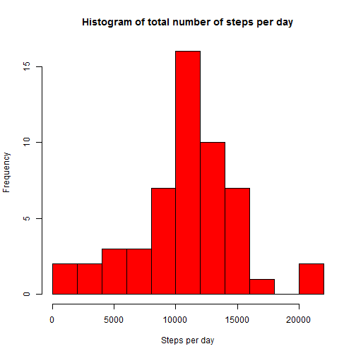
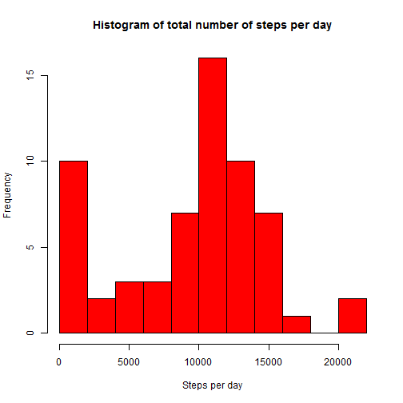
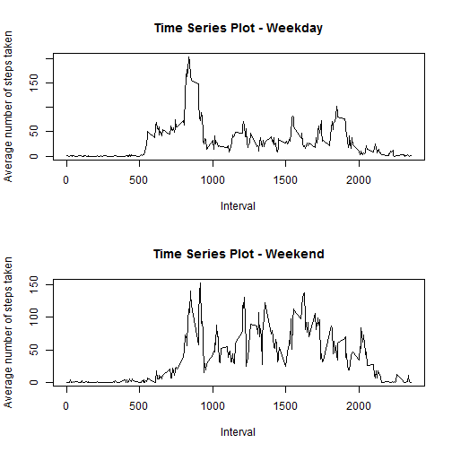

<b>Loading and preprocessing the data</b>

```r
d <- read.csv("activity.csv", colClasses = "character")
d$steps <- as.numeric(d$steps)
d$date <- as.Date(d$date, "%Y-%m-%d")
d$interval <- as.numeric(d$interval)
```

<b>What is mean total number of steps taken per day?</b>


```r
agData <- aggregate(steps ~ date, data = d, sum, na.rm = TRUE) 
hist(agData$steps, breaks = 10, col = "red", xlab = "Steps per day", main = "Histogram of total number of steps per day")
```

 

```r
print(mean(agData$steps))
```

```
## [1] 10766.19
```

```r
print(median(agData$steps))
```

```
## [1] 10765
```

<b>What is the average daily activity pattern?</b>

```r
avgData <- aggregate(steps ~ interval, data = d, mean, na.rm = TRUE)
  
plot(avgData$interval, avgData$steps, type = "l", main = "Time Series Plot", ylab = "Average number of steps taken", xlab="Interval")
```

 

<b>Which 5-minute interval, on average across all the days in the dataset, contains the maximum number of steps?</b>

```r
print(avgData[which.max(avgData$steps),])
```

```
##     interval    steps
## 104      835 206.1698
```

<b>Imputing missing values</b>

The missing values are the ones in the TRUE column

```r
 print(table(is.na(d$steps)))
```

```
## 
## FALSE  TRUE 
## 15264  2304
```

The strategy that I used is to replace each missing value (NA) with the average value
of that day.


```r
  avgDataPerDate <- aggregate(steps ~ date, data = d, mean, na.rm = TRUE)
 newD <- d
  total <- 0
 j <- 1
 for (i in 1:nrow(newD)) {
   if (is.na(newD[i, 1])) {
     if ( isTRUE(all.equal(newD[i, 2], avgDataPerDate[j, 1]))) {
       j <- j + 1
     }
     newD[i, 1] <- avgDataPerDate[j, 2]
   }
 }

newAgData <- aggregate(steps ~ date, data = newD, sum, na.rm = TRUE)
hist(newAgData$steps, breaks = 10, col = "red", xlab = "Steps per day", main = "Histogram of total number of steps per day")
```

 

As we can see there is a difference on the estimates. By replacing the NA values with the daily
average value we can see the total average number is getting lower, while the median is around the
same.


```r
print(mean(newAgData$steps))
```

```
## [1] 9370.754
```

```r
print(median(newAgData$steps))
```

```
## [1] 10395
```

<b>Are there differences in activity patterns between weekdays and weekends?</b>

New Factor Variable

```r
isWeekend <- function(date) {
  weekDays <- c("Monday", "Tuesday", "Wednesday", "Thursday", "Friday")
  day <- weekdays(date)
  
  if (day %in% weekDays) {
    return ("weekday")
  } else {
    return ("weekend")
  }
}

newD$day <- sapply(newD$date, FUN = isWeekend)
```

Panel Plot

```r
avgNewD <- aggregate(steps ~ interval + day, data = newD, mean)
avgNewDWeekday <- subset(avgNewD, avgNewD$day == "weekday")
avgNewDWeekend <- subset(avgNewD, avgNewD$day == "weekend")
par(mfrow = c(2,1))
plot(avgNewDWeekday$interval, avgNewDWeekday$steps, type = "l", main = "Time Series Plot - Weekday", ylab = "Average number of steps taken", xlab="Interval")
plot(avgNewDWeekend$interval, avgNewDWeekend$steps, type = "l", main = "Time Series Plot - Weekend", ylab = "Average number of steps taken", xlab="Interval")
```

 
